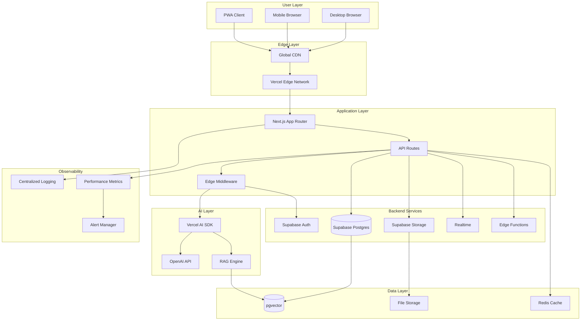

# NEET Prep AI Platform - System Architecture Document

## Architecture Overview

This document defines the comprehensive system architecture for the NEET Prep AI Platform, focusing on scalability, performance, security, and offline capabilities. The architecture follows a modern, cloud-native approach with emphasis on edge computing and AI integration.

## System Context & Goals

### Architectural Goals

1. **Scalability**: Support 100K+ concurrent users
2. **Performance**: Sub-3s page loads on 3G networks
3. **Availability**: 99.9% uptime with global distribution
4. **Security**: Enterprise-grade security with compliance
5. **Offline-First**: Robust offline capabilities for emerging markets
6. **AI-Native**: Seamless AI integration for personalized learning

### System Constraints

- Budget-conscious infrastructure costs
- Mobile-first user base in India
- Variable network connectivity
- Compliance with Indian data protection laws
- Real-time requirements for AI interactions

## High-Level Architecture



## Technology Stack

### Frontend Stack

- **Framework**: Next.js 14+ (App Router)
- **Language**: TypeScript 5+
- **Styling**: Tailwind CSS 3+
- **State Management**: Zustand + React Query
- **PWA**: Workbox for service worker management
- **Testing**: Jest + Testing Library + Playwright

### Backend Stack

- **Primary Backend**: Supabase
  - **Database**: PostgreSQL 15+ with pgvector
  - **Authentication**: Supabase Auth (JWT-based)
  - **Storage**: Supabase Storage (S3-compatible)
  - **Realtime**: Supabase Realtime (WebSocket)
  - **Edge Functions**: Deno-based serverless functions

### AI/ML Stack

- **AI Framework**: Vercel AI SDK
- **LLM Provider**: OpenAI (GPT-4, GPT-3.5-turbo)
- **Embeddings**: OpenAI text-embedding-3-small
- **Vector Database**: pgvector (PostgreSQL extension)
- **RAG Framework**: Custom implementation with LangChain concepts

### Infrastructure Stack

- **Hosting**: Vercel (Edge Functions + Static Hosting)
- **CDN**: Vercel Edge Network
- **Monitoring**: Vercel Analytics + Custom instrumentation
- **Caching**: Redis (Upstash) + Browser caching
- **CI/CD**: GitHub Actions + Vercel Git integration

## Detailed Component Architecture

### Frontend Architecture

#### Component Structure

```
app/
├── (auth)/                 # Auth route group
│   ├── login/
│   └── register/
├── (dashboard)/           # Authenticated routes
│   ├── courses/
│   ├── quiz/
│   └── tutor/
├── api/                   # API routes
│   ├── auth/
│   ├── content/
│   ├── quiz/
│   └── ai/
├── components/            # Reusable components
│   ├── ui/               # Base UI components
│   ├── course/           # Course-specific components
│   ├── quiz/             # Quiz components
│   └── tutor/            # AI tutor components
└── lib/                  # Utilities and configurations
    ├── supabase/
    ├── ai/
    └── utils/
```

#### PWA Implementation

```typescript
// Service Worker Strategy
const strategies = {
  // Critical resources - Cache First
  static: new CacheFirst({
    cacheName: 'static-resources',
    plugins: [new ExpirationPlugin({ maxEntries: 100, maxAgeSeconds: 60 * 60 * 24 * 30 })],
  }),

  // API responses - Network First with fallback
  api: new NetworkFirst({
    cacheName: 'api-responses',
    networkTimeoutSeconds: 3,
    plugins: [new BackgroundSyncPlugin('api-sync')],
  }),

  // Content - Stale While Revalidate
  content: new StaleWhileRevalidate({
    cacheName: 'content-cache',
    plugins: [new CacheableResponsePlugin({ statuses: [0, 200] })],
  }),
}
```

#### State Management

```typescript
// Zustand store structure
interface AppState {
  user: User | null
  course: CourseState
  quiz: QuizState
  tutor: TutorState
  offline: OfflineState
}

// React Query for server state
const queryClient = new QueryClient({
  defaultOptions: {
    queries: {
      staleTime: 5 * 60 * 1000, // 5 minutes
      cacheTime: 10 * 60 * 1000, // 10 minutes
      retry: (failureCount, error) => {
        if (error?.status === 404) return false
        return failureCount < 3
      },
    },
  },
})
```

### Backend Architecture

#### Database Schema Design

```sql
-- Users and Authentication
CREATE TABLE profiles (
  id UUID REFERENCES auth.users PRIMARY KEY,
  email TEXT UNIQUE NOT NULL,
  full_name TEXT,
  avatar_url TEXT,
  role user_role DEFAULT 'student',
  created_at TIMESTAMP DEFAULT NOW(),
  updated_at TIMESTAMP DEFAULT NOW()
);

-- Content Hierarchy
CREATE TABLE courses (
  id UUID PRIMARY KEY DEFAULT gen_random_uuid(),
  title TEXT NOT NULL,
  description TEXT,
  thumbnail_url TEXT,
  is_published BOOLEAN DEFAULT false,
  created_at TIMESTAMP DEFAULT NOW()
);

CREATE TABLE modules (
  id UUID PRIMARY KEY DEFAULT gen_random_uuid(),
  course_id UUID REFERENCES courses(id) ON DELETE CASCADE,
  title TEXT NOT NULL,
  description TEXT,
  order_index INTEGER NOT NULL,
  created_at TIMESTAMP DEFAULT NOW()
);

CREATE TABLE lessons (
  id UUID PRIMARY KEY DEFAULT gen_random_uuid(),
  module_id UUID REFERENCES modules(id) ON DELETE CASCADE,
  title TEXT NOT NULL,
  content JSONB, -- Rich content structure
  content_type lesson_type DEFAULT 'text',
  duration_minutes INTEGER,
  order_index INTEGER NOT NULL,
  is_published BOOLEAN DEFAULT false,
  created_at TIMESTAMP DEFAULT NOW()
);

-- Quiz System
CREATE TABLE quizzes (
  id UUID PRIMARY KEY DEFAULT gen_random_uuid(),
  lesson_id UUID REFERENCES lessons(id) ON DELETE CASCADE,
  title TEXT NOT NULL,
  instructions TEXT,
  time_limit_minutes INTEGER,
  passing_score INTEGER DEFAULT 70,
  created_at TIMESTAMP DEFAULT NOW()
);

CREATE TABLE questions (
  id UUID PRIMARY KEY DEFAULT gen_random_uuid(),
  quiz_id UUID REFERENCES quizzes(id) ON DELETE CASCADE,
  question_text TEXT NOT NULL,
  question_type question_type DEFAULT 'multiple_choice',
  options JSONB, -- Array of answer options
  correct_answers JSONB, -- Array of correct option indices
  explanation TEXT,
  points INTEGER DEFAULT 1,
  order_index INTEGER NOT NULL
);

-- Vector Embeddings for RAG
CREATE TABLE content_embeddings (
  id UUID PRIMARY KEY DEFAULT gen_random_uuid(),
  content_id UUID, -- References various content types
  content_type TEXT NOT NULL, -- 'lesson', 'quiz', 'explanation'
  content_text TEXT NOT NULL,
  embedding vector(1536), -- OpenAI embedding dimension
  metadata JSONB,
  created_at TIMESTAMP DEFAULT NOW()
);

-- User Progress and Analytics
CREATE TABLE user_progress (
  id UUID PRIMARY KEY DEFAULT gen_random_uuid(),
  user_id UUID REFERENCES profiles(id) ON DELETE CASCADE,
  lesson_id UUID REFERENCES lessons(id) ON DELETE CASCADE,
  status progress_status DEFAULT 'not_started',
  completion_percentage INTEGER DEFAULT 0,
  time_spent_seconds INTEGER DEFAULT 0,
  last_accessed_at TIMESTAMP DEFAULT NOW(),
  completed_at TIMESTAMP,
  UNIQUE(user_id, lesson_id)
);

CREATE TABLE quiz_attempts (
  id UUID PRIMARY KEY DEFAULT gen_random_uuid(),
  user_id UUID REFERENCES profiles(id) ON DELETE CASCADE,
  quiz_id UUID REFERENCES quizzes(id) ON DELETE CASCADE,
  score INTEGER NOT NULL,
  max_score INTEGER NOT NULL,
  answers JSONB NOT NULL, -- User's answer data
  time_taken_seconds INTEGER,
  started_at TIMESTAMP DEFAULT NOW(),
  completed_at TIMESTAMP DEFAULT NOW()
);
```

#### Row Level Security (RLS) Policies

```sql
-- Enable RLS on all tables
ALTER TABLE profiles ENABLE ROW LEVEL SECURITY;
ALTER TABLE courses ENABLE ROW LEVEL SECURITY;
ALTER TABLE user_progress ENABLE ROW LEVEL SECURITY;

-- Example policies
CREATE POLICY "Users can view their own profile" ON profiles
  FOR SELECT USING (auth.uid() = id);

CREATE POLICY "Students can view published courses" ON courses
  FOR SELECT USING (
    is_published = true OR
    EXISTS (
      SELECT 1 FROM profiles
      WHERE id = auth.uid() AND role IN ('educator', 'admin')
    )
  );

CREATE POLICY "Users can manage their own progress" ON user_progress
  FOR ALL USING (auth.uid() = user_id);
```

#### API Design

```typescript
// RESTful API structure
/api/
├── auth/
│   ├── login          # POST - User authentication
│   ├── register       # POST - User registration
│   └── refresh        # POST - Token refresh
├── courses/
│   ├── [id]           # GET - Course details
│   ├── [id]/modules   # GET - Course modules
│   └── search         # GET - Course search
├── lessons/
│   ├── [id]           # GET - Lesson content
│   └── [id]/progress  # PUT - Update progress
├── quiz/
│   ├── [id]           # GET - Quiz details
│   ├── [id]/attempt   # POST - Submit quiz attempt
│   └── [id]/results   # GET - Quiz results
└── ai/
    ├── tutor          # POST - AI tutor interaction
    └── embeddings     # POST - Generate embeddings
```

### AI/ML Architecture

#### RAG (Retrieval Augmented Generation) System

```typescript
// RAG Pipeline Implementation
class RAGEngine {
  private vectorStore: VectorStore
  private embeddings: OpenAIEmbeddings
  private llm: ChatOpenAI

  async generateResponse(query: string, userId: string): Promise<string> {
    // 1. Generate query embedding
    const queryEmbedding = await this.embeddings.embedQuery(query)

    // 2. Similarity search
    const relevantDocs = await this.vectorStore.similaritySearch(queryEmbedding, {
      k: 5,
      filter: { userId },
    })

    // 3. Context assembly
    const context = this.assembleContext(relevantDocs, userId)

    // 4. Prompt engineering
    const prompt = this.createPrompt(query, context)

    // 5. LLM generation
    const response = await this.llm.call(prompt)

    return response.content
  }

  private assembleContext(docs: Document[], userId: string): string {
    // Assemble relevant context from retrieved documents
    // Include user's learning progress and preferences
    return docs.map(doc => doc.pageContent).join('\n\n')
  }
}
```

#### Content Ingestion Pipeline

```typescript
// Automated content processing
class ContentProcessor {
  async ingestContent(content: LessonContent): Promise<void> {
    // 1. Text extraction
    const textChunks = await this.chunkText(content.text)

    // 2. Generate embeddings
    const embeddings = await Promise.all(textChunks.map(chunk => this.generateEmbedding(chunk)))

    // 3. Store in vector database
    await this.storeEmbeddings(content.id, textChunks, embeddings)

    // 4. Update search index
    await this.updateSearchIndex(content)
  }

  private async chunkText(text: string): Promise<string[]> {
    // Intelligent chunking preserving context
    // Consider sentence boundaries, headings, etc.
    const chunks = []
    const sentences = text.split(/[.!?]+/)

    let currentChunk = ''
    for (const sentence of sentences) {
      if ((currentChunk + sentence).length > 1000) {
        chunks.push(currentChunk.trim())
        currentChunk = sentence
      } else {
        currentChunk += sentence + '. '
      }
    }

    if (currentChunk.trim()) {
      chunks.push(currentChunk.trim())
    }

    return chunks
  }
}
```

## Security Architecture

### Authentication & Authorization

```typescript
// JWT-based authentication with Supabase
interface SecurityContext {
  user: User
  roles: string[]
  permissions: string[]
  sessionToken: string
}

// Role-based access control
const permissions = {
  student: ['read:courses', 'write:progress', 'read:own_data'],
  educator: ['read:courses', 'write:courses', 'read:analytics'],
  admin: ['*'], // Full access
  moderator: ['read:*', 'write:moderation'],
}

// Middleware for route protection
export async function authMiddleware(request: NextRequest) {
  const token = request.headers.get('authorization')?.replace('Bearer ', '')

  if (!token) {
    return new Response('Unauthorized', { status: 401 })
  }

  try {
    const { data: user } = await supabase.auth.getUser(token)

    if (!user) {
      return new Response('Invalid token', { status: 401 })
    }

    // Add user context to request
    request.headers.set('x-user-id', user.id)
    request.headers.set('x-user-role', user.role)

    return NextResponse.next()
  } catch (error) {
    return new Response('Token validation failed', { status: 401 })
  }
}
```

### Data Encryption & Privacy

```typescript
// Encryption utilities
class EncryptionService {
  private readonly algorithm = 'aes-256-gcm'
  private readonly keyLength = 32

  async encryptSensitiveData(data: string): Promise<EncryptedData> {
    const key = crypto.randomBytes(this.keyLength)
    const iv = crypto.randomBytes(16)
    const cipher = crypto.createCipher(this.algorithm, key)

    const encrypted = Buffer.concat([cipher.update(data, 'utf8'), cipher.final()])

    return {
      encrypted: encrypted.toString('base64'),
      key: key.toString('base64'),
      iv: iv.toString('base64'),
      tag: cipher.getAuthTag().toString('base64'),
    }
  }
}

// GDPR compliance utilities
class PrivacyService {
  async anonymizeUserData(userId: string): Promise<void> {
    // Remove personally identifiable information
    await supabase
      .from('profiles')
      .update({
        email: `deleted_${Date.now()}@example.com`,
        full_name: 'Deleted User',
        avatar_url: null,
      })
      .eq('id', userId)

    // Keep learning data but anonymized
    await this.anonymizeLearningData(userId)
  }
}
```

## Performance Architecture

### Caching Strategy

```typescript
// Multi-layer caching implementation
class CacheManager {
  private redis: Redis
  private browserCache: Cache

  async get(key: string): Promise<any> {
    // 1. Check browser cache first
    const browserResult = await this.browserCache.match(key)
    if (browserResult) return browserResult

    // 2. Check Redis cache
    const redisResult = await this.redis.get(key)
    if (redisResult) {
      // Update browser cache
      await this.browserCache.put(key, new Response(redisResult))
      return JSON.parse(redisResult)
    }

    // 3. Cache miss - fetch from database
    return null
  }
}

// Cache invalidation patterns
const cacheConfig = {
  courses: { ttl: 3600, tags: ['course', 'content'] },
  userProgress: { ttl: 300, tags: ['user', 'progress'] },
  quizResults: { ttl: 1800, tags: ['quiz', 'results'] },
  aiResponses: { ttl: 7200, tags: ['ai', 'responses'] },
}
```

### Database Optimization

```sql
-- Performance indexes
CREATE INDEX CONCURRENTLY idx_lessons_module_published
ON lessons(module_id, is_published) WHERE is_published = true;

CREATE INDEX CONCURRENTLY idx_content_embeddings_vector
ON content_embeddings USING ivfflat (embedding vector_cosine_ops);

CREATE INDEX CONCURRENTLY idx_user_progress_user_lesson
ON user_progress(user_id, lesson_id);

CREATE INDEX CONCURRENTLY idx_quiz_attempts_user_created
ON quiz_attempts(user_id, created_at DESC);

-- Partial indexes for common queries
CREATE INDEX CONCURRENTLY idx_courses_published
ON courses(created_at DESC) WHERE is_published = true;
```

## Deployment Architecture

### Infrastructure as Code

```yaml
# Vercel configuration
# vercel.json
{
  'version': 2,
  'builds': [{ 'src': 'next.config.js', 'use': '@vercel/next' }],
  'functions': { 'app/api/**/*.ts': { 'maxDuration': 30 } },
  'rewrites': [{ 'source': '/api/ai/:path*', 'destination': '/api/ai/:path*' }],
  'headers':
    [
      {
        'source': '/(.*)',
        'headers':
          [
            { 'key': 'X-Content-Type-Options', 'value': 'nosniff' },
            { 'key': 'X-Frame-Options', 'value': 'DENY' },
            { 'key': 'X-XSS-Protection', 'value': '1; mode=block' },
          ],
      },
    ],
}
```

### Environment Configuration

```typescript
// Environment-specific configurations
const config = {
  development: {
    supabase: {
      url: process.env.NEXT_PUBLIC_SUPABASE_URL,
      anonKey: process.env.NEXT_PUBLIC_SUPABASE_ANON_KEY,
    },
    openai: {
      apiKey: process.env.OPENAI_API_KEY,
      model: 'gpt-3.5-turbo',
    },
    redis: {
      url: process.env.REDIS_URL,
    },
  },
  production: {
    supabase: {
      url: process.env.NEXT_PUBLIC_SUPABASE_URL,
      anonKey: process.env.NEXT_PUBLIC_SUPABASE_ANON_KEY,
    },
    openai: {
      apiKey: process.env.OPENAI_API_KEY,
      model: 'gpt-4',
    },
    redis: {
      url: process.env.REDIS_URL,
    },
  },
}
```

## Monitoring & Observability

### Performance Monitoring

```typescript
// Custom performance monitoring
class PerformanceMonitor {
  async trackAPIPerformance(request: Request): Promise<void> {
    const startTime = performance.now()

    // Track API response time
    const endTime = performance.now()
    const duration = endTime - startTime

    // Send metrics to observability platform
    await this.sendMetric({
      name: 'api_response_time',
      value: duration,
      labels: {
        endpoint: request.url,
        method: request.method,
        status: response.status,
      },
    })
  }

  async trackUserInteraction(action: string, metadata: any): Promise<void> {
    // Track user interactions for UX analysis
    await this.sendEvent({
      event: 'user_interaction',
      action,
      metadata,
      timestamp: new Date().toISOString(),
    })
  }
}
```

### Error Handling & Logging

```typescript
// Centralized error handling
class ErrorHandler {
  async handleError(error: Error, context: ErrorContext): Promise<void> {
    // Log error with context
    console.error('Application Error:', {
      message: error.message,
      stack: error.stack,
      context,
      timestamp: new Date().toISOString(),
    })

    // Send to error tracking service
    await this.reportError(error, context)

    // Trigger alerts for critical errors
    if (this.isCriticalError(error)) {
      await this.sendAlert(error, context)
    }
  }
}
```

## Scalability Considerations

### Horizontal Scaling

```typescript
// Load balancing and auto-scaling
const scalingConfig = {
  api: {
    minInstances: 2,
    maxInstances: 50,
    targetCPU: 70,
    targetMemory: 80,
  },
  database: {
    readReplicas: 3,
    connectionPooling: true,
    maxConnections: 100,
  },
  cache: {
    clusters: 3,
    replicationFactor: 2,
    evictionPolicy: 'allkeys-lru',
  },
}
```

### Data Partitioning

```sql
-- Database partitioning for large tables
CREATE TABLE quiz_attempts (
  id UUID PRIMARY KEY DEFAULT gen_random_uuid(),
  user_id UUID NOT NULL,
  quiz_id UUID NOT NULL,
  created_at TIMESTAMP DEFAULT NOW(),
  -- other columns
) PARTITION BY RANGE (created_at);

-- Monthly partitions
CREATE TABLE quiz_attempts_2024_01 PARTITION OF quiz_attempts
FOR VALUES FROM ('2024-01-01') TO ('2024-02-01');

CREATE TABLE quiz_attempts_2024_02 PARTITION OF quiz_attempts
FOR VALUES FROM ('2024-02-01') TO ('2024-03-01');
```

## Integration Architecture

### Third-Party Integrations

```typescript
// Payment gateway integration (future)
interface PaymentProvider {
  processPayment(amount: number, currency: string): Promise<PaymentResult>
  refundPayment(transactionId: string): Promise<RefundResult>
}

// Analytics integration
class AnalyticsService {
  async trackEvent(event: AnalyticsEvent): Promise<void> {
    // Send to multiple analytics providers
    await Promise.all([
      this.sendToGoogleAnalytics(event),
      this.sendToMixpanel(event),
      this.sendToCustomAnalytics(event),
    ])
  }
}

// Email service integration
class EmailService {
  async sendTransactionalEmail(template: string, recipient: string, data: any): Promise<void> {
    // Use Supabase Edge Functions for email delivery
    await supabase.functions.invoke('send-email', {
      body: { template, recipient, data },
    })
  }
}
```

## Future Architecture Considerations

### Microservices Migration Path

```typescript
// Preparation for potential microservices migration
interface ServiceBoundaries {
  userService: {
    endpoints: ['/api/auth/*', '/api/users/*']
    database: 'users_db'
  }
  contentService: {
    endpoints: ['/api/courses/*', '/api/lessons/*']
    database: 'content_db'
  }
  aiService: {
    endpoints: ['/api/ai/*']
    database: 'ai_db'
  }
  analyticsService: {
    endpoints: ['/api/analytics/*']
    database: 'analytics_db'
  }
}
```

### Edge Computing Expansion

```typescript
// Edge function distribution
const edgeConfig = {
  regions: ['bom1', 'sin1', 'hnd1'], // Focus on Asia-Pacific
  functions: {
    ai_responses: { regions: ['bom1'], timeout: 30 },
    content_delivery: { regions: ['bom1', 'sin1'], timeout: 10 },
    user_analytics: { regions: ['bom1'], timeout: 5 },
  },
}
```

## Architecture Decision Records (ADRs)

### ADR-001: Choose Supabase over Custom Backend

**Decision**: Use Supabase as primary backend service
**Rationale**:

- Reduces development time
- Built-in authentication and authorization
- PostgreSQL with pgvector for AI capabilities
- Real-time subscriptions
- Automatic API generation

### ADR-002: Next.js App Router over Pages Router

**Decision**: Use Next.js 14+ App Router
**Rationale**:

- Better performance with server components
- Improved caching strategies
- Native TypeScript support
- Better developer experience

### ADR-003: Vercel AI SDK over Custom AI Integration

**Decision**: Use Vercel AI SDK for AI integrations
**Rationale**:

- Simplified streaming responses
- Built-in provider abstractions
- Excellent TypeScript support
- Performance optimizations

## Conclusion

This architecture provides a solid foundation for the NEET Prep AI Platform with emphasis on scalability, performance, and user experience. The modular design allows for incremental improvements and future enhancements while maintaining system reliability and security.
