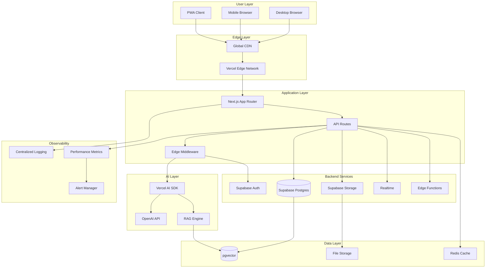

# High-Level Architecture

```mermaid
graph TB
    subgraph "User Layer"
        PWA[PWA Client]
        Mobile[Mobile Browser]
        Desktop[Desktop Browser]
    end

    subgraph "Edge Layer"
        CDN[Global CDN]
        Edge[Vercel Edge Network]
    end

    subgraph "Application Layer"
        NextJS[Next.js App Router]
        API[API Routes]
        MW[Edge Middleware]
    end

    subgraph "AI Layer"
        VSDK[Vercel AI SDK]
        OpenAI[OpenAI API]
        RAG[RAG Engine]
    end

    subgraph "Backend Services"
        Auth[Supabase Auth]
        DB[(Supabase Postgres)]
        Storage[Supabase Storage]
        RT[Realtime]
        EF[Edge Functions]
    end

    subgraph "Data Layer"
        Vector[(pgvector)]
        Files[File Storage]
        Cache[Redis Cache]
    end

    subgraph "Observability"
        Logs[Centralized Logging]
        Metrics[Performance Metrics]
        Alerts[Alert Manager]
    end

    PWA --> CDN
    Mobile --> CDN
    Desktop --> CDN
    CDN --> Edge
    Edge --> NextJS
    NextJS --> API
    API --> MW
    MW --> Auth
    MW --> VSDK
    VSDK --> OpenAI
    VSDK --> RAG
    RAG --> Vector
    API --> DB
    API --> Storage
    API --> RT
    API --> EF
    DB --> Vector
    Storage --> Files
    API --> Cache
    NextJS --> Logs
    API --> Metrics
    Metrics --> Alerts
```
