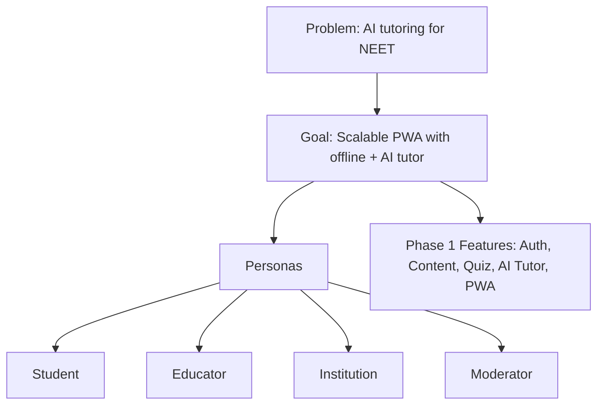
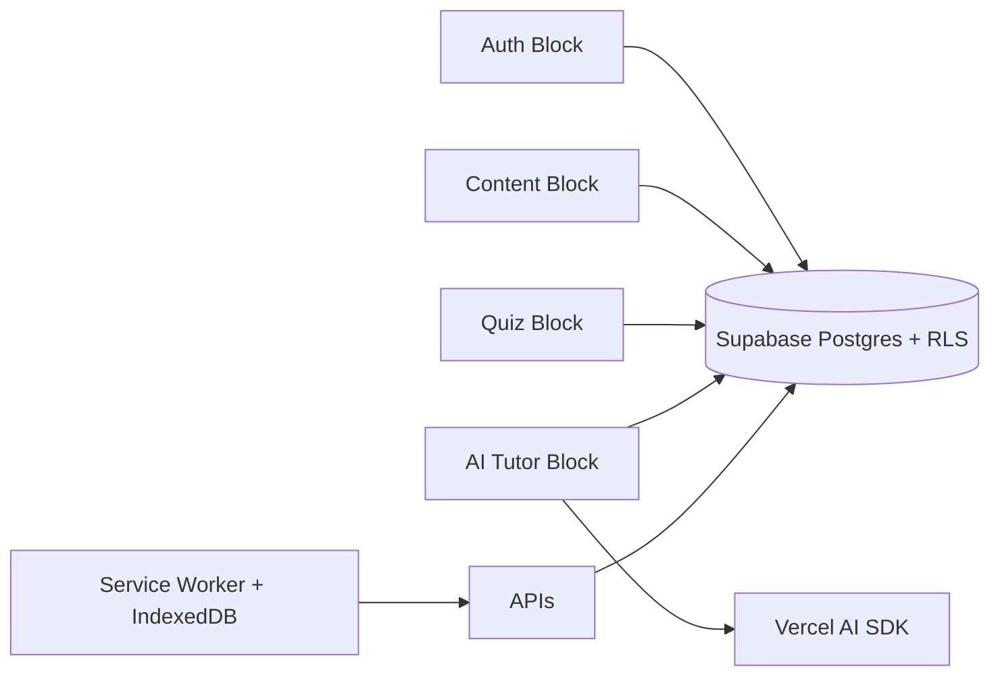
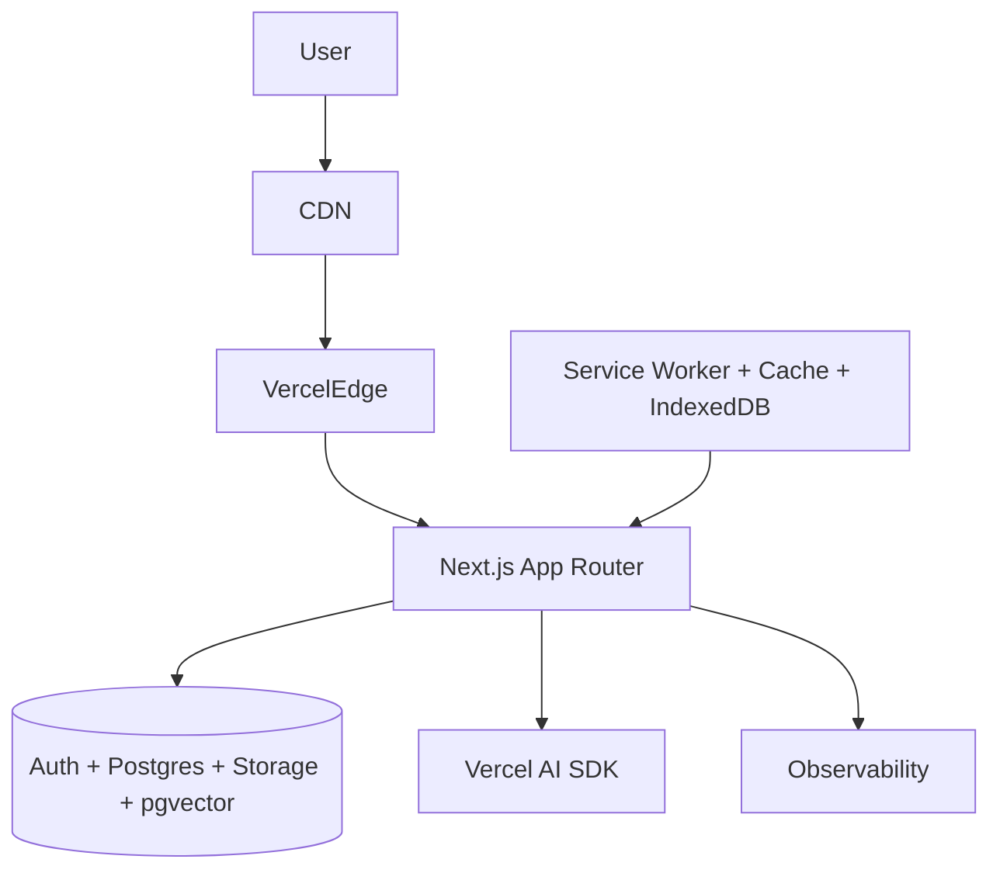
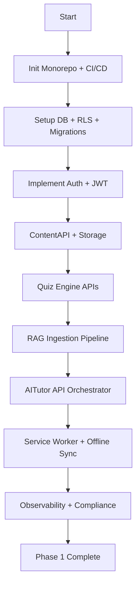

# Phase 1 BMAD Extended Diagrams

## Blueprint → Model → Architect → Develop

### Blueprint (Problem, Personas, Features)

### Model (Blocks, Data Flow)

### Architect (System Design)

### Develop (Action Steps)

